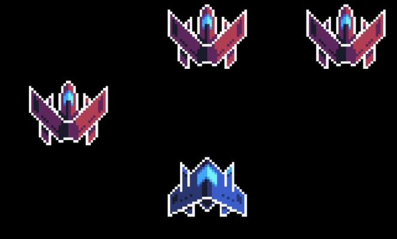
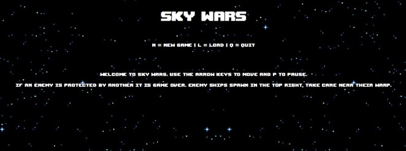
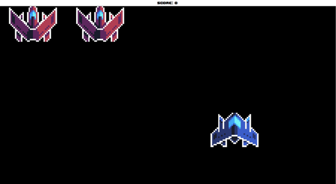
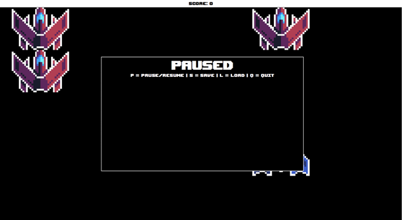
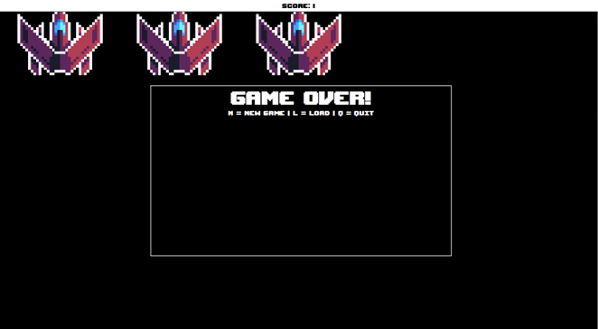

  

# Installation
You may play the game by installing the latest release and running the JAR file. Alternatively, you may import the source code into an appropriate IDE (I developed this in eclipse) and run/edit it that way. I have also inlcuded the JUnit tests used to test the program.

# Controls:

Use the arrow keys to move and p to pause.

N = new game | L = load | Q = quit

# Rules:

Gameplay Style: The game is played in real-time, allowing the player to move freely without waiting for turns. Enemy ships spawn and move continuously on a timer-based system.

Game Over Conditions: Only one ship can occupy a square at a time. If the player attempts to move to a square already occupied by an enemy ship, it destroys it, but if surrounded by more than one enemy ships on neighboring squares, it results in a game over. This adds a strategic challenge to the game, requiring careful planning and movement.

Enemy Spawn Point: Enemy ships spawn from the top right of the screen. The player ship can also move to this location, but it's a risky strategy, as enemies emerging from the spawn point can quickly overwhelm and destroy the player ship, leading to a game over.

Sky Size: The game area is expanded to a 5x5 grid, providing the player with more room to maneuver and adding complexity to the gameplay.

Enemy Ship Types: While the game currently features only one type of enemy ship, each enemy ship has a "type" variable. This variable allows for potential expansion in the future, enabling the addition of more enemy ship types with unique characteristics and behaviors.

# Screenshots:

## Start Menu

## Game Screen

## Pause Menu

## Game Over Screen

# Resource Credits:

•	Sprites used: https://opengameart.org/content/spaceships-32x32

•	Font used: https://www.dafont.com/upheaval.font

•	Start menu background: https://wall.alphacoders.com/big.php?i=885542

•	Soundtrack and sound effects made/obtained using https://www.beepbox.co/

